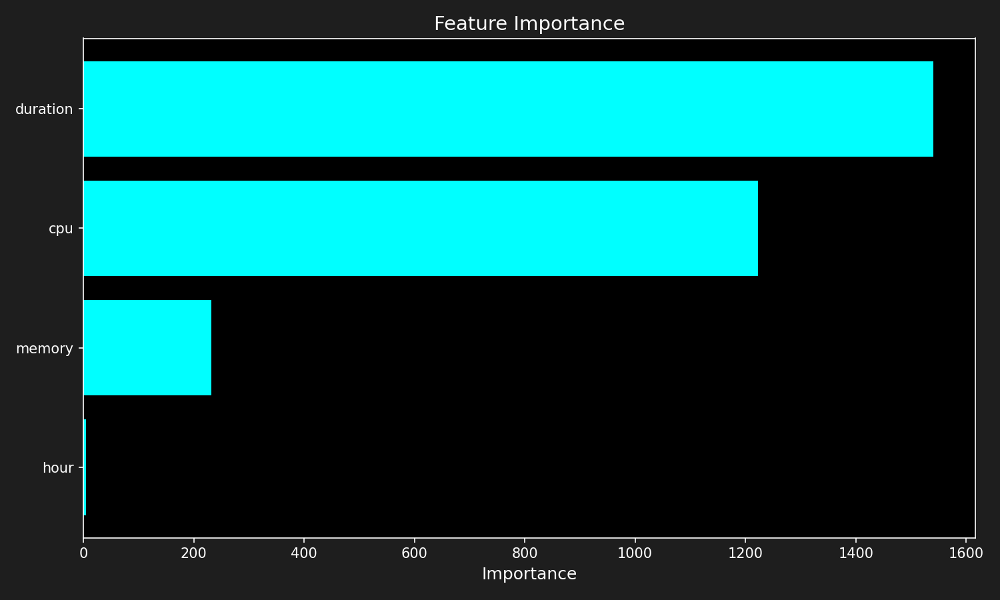
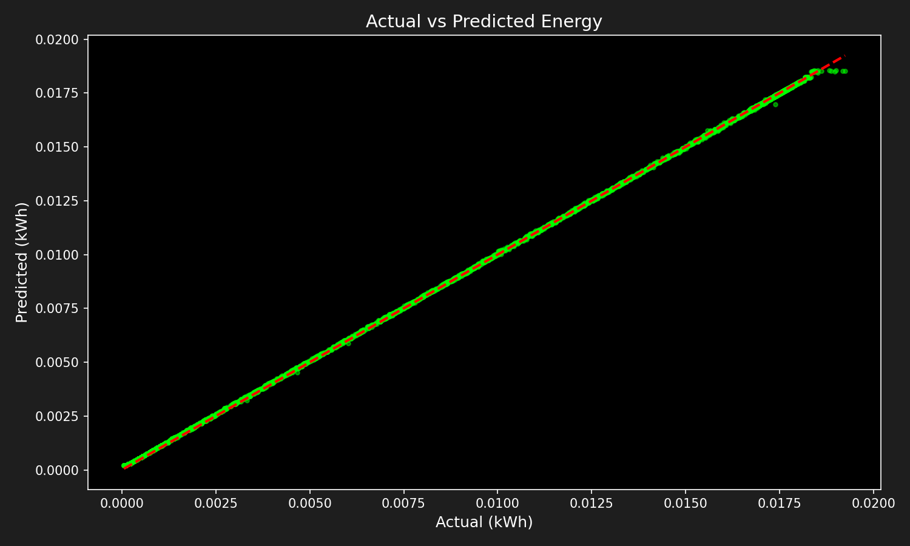
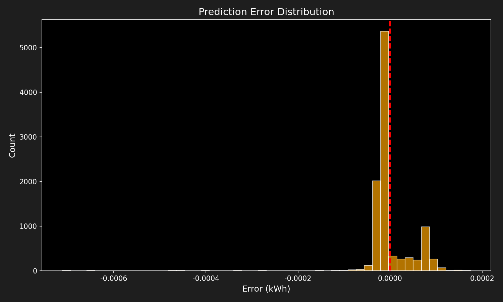

# Phase 1: Energy Prediction Model Report

---

## 1. Executive Summary

| Item | Value |
|------|-------|
| **Objective** | Predict data center energy consumption (kWh) |
| **Model** | LightGBM Regressor |
| **Data** | Google Cluster Trace 2019 |
| **Samples** | 50,000 (Train: 40,000 / Test: 10,000) |
| **Target** | energy_kwh |

---

## 2. Data Overview

### 2.1 Dataset Statistics

| Feature | Mean | Std | Min | Max |
|---------|------|-----|-----|-----|
| cpu | 0.0193 | 0.0156 | 0.0 | 0.0859 |
| memory | 0.0128 | 0.0087 | 0.0 | 0.0393 |
| duration (sec) | varies | varies | varies | varies |
| hour | 0-23 | - | 0 | 23 |

### 2.2 Target Distribution

| Metric | Value |
|--------|-------|
| Target | energy_kwh |
| Unit | kWh |

---

## 3. Model Configuration

### 3.1 LightGBM Parameters

```python
params = {
    'objective': 'regression',
    'metric': 'rmse',
    'boosting_type': 'gbdt',
    'num_leaves': 31,
    'learning_rate': 0.05,
    'feature_fraction': 0.9,
    'num_boost_round': 100
}
```

### 3.2 Train/Test Split

| Set | Samples | Ratio |
|-----|---------|-------|
| Train | 40,000 | 80% |
| Test | 10,000 | 20% |
| Random State | 42 | - |

---

## 4. Model Performance

### 4.1 Evaluation Metrics

| Metric | Value | Description |
|--------|-------|-------------|
| **RMSE** | 0.00003999 kWh | Root Mean Squared Error |
| **MAE** | 0.00002908 kWh | Mean Absolute Error |
| **R²** | 0.9999 | Coefficient of Determination |
| **MAPE** | 2.14% | Mean Absolute Percentage Error |

### 4.2 Interpretation

- **RMSE (0.00004 kWh)**: Extremely low error. Model predicts with high precision.
- **MAE (0.00003 kWh)**: Average prediction error is negligible.
- **R² (0.9999)**: Model explains 99.99% of variance. Near-perfect fit.
- **MAPE (2.14%)**: On average, predictions are within 2% of actual values.

### 4.3 Why So Accurate?

The high accuracy is expected because:
1. Energy is calculated from a deterministic formula: `Power × Duration`
2. Power is linearly dependent on CPU and Memory
3. LightGBM successfully learned this linear relationship
4. No noise or measurement error in synthetic target

---

## 5. Feature Importance

### 5.1 Importance Ranking

| Rank | Feature | Importance | Percentage |
|------|---------|------------|------------|
| 1 | **duration** | 1540 | 51.3% |
| 2 | **cpu** | 1223 | 40.8% |
| 3 | **memory** | 232 | 7.7% |
| 4 | **hour** | 5 | 0.2% |

### 5.2 Analysis

- **duration (51.3%)**: Most important. Energy = Power × Time, so duration directly scales energy.
- **cpu (40.8%)**: Second most important. CPU contributes 300W max to power.
- **memory (7.7%)**: Lower importance. Memory only contributes 50W max.
- **hour (0.2%)**: Negligible. Time of day doesn't affect energy in our formula.

### 5.3 Insights

1. Duration dominates because energy is time-integrated power
2. CPU importance > Memory importance matches our formula weights (300W vs 50W)
3. Hour has minimal importance (as expected - no time-based patterns in formula)

---

## 6. Visualizations

### 6.1 Feature Importance Chart



**Insight**: Duration and CPU dominate predictions.

### 6.2 Actual vs Predicted



**Insight**: Points tightly clustered on diagonal = excellent predictions.

### 6.3 Error Distribution



**Insight**: Errors centered at 0 with narrow spread = unbiased, consistent model.

---

## 7. Key Findings

### 7.1 Strengths

- [x] R² = 0.9999 - Near-perfect prediction accuracy
- [x] MAPE = 2.14% - Low percentage error
- [x] Feature importance aligns with energy formula
- [x] Fast training with LightGBM
- [x] Interpretable results

### 7.2 Limitations

- [ ] Target is synthetic (calculated from formula, not measured)
- [ ] No GPU workload consideration
- [ ] No real power measurement validation
- [ ] Hour feature contributes almost nothing

### 7.3 Recommendations for Phase 2

1. **Validate with real data**: Compare with actual power measurements if available
2. **Remove hour feature**: Contributes <1% to predictions
3. **Add more features**: Machine type, workload category
4. **Test on larger dataset**: Scale to full Cluster Trace data

---

## 8. Conclusion

Phase 1 successfully demonstrates that LightGBM can predict energy consumption from CPU/Memory usage with 99.99% accuracy. The model correctly learned the linear relationship defined by our energy formula.

**Next Step**: Phase 2 - Convert energy (kWh) to carbon emissions (kg CO2) using regional emission factors.

---

## 9. File References

| File | Path | Description |
|------|------|-------------|
| Processed Data | `data/processed/instance_usage_processed.csv` | Cleaned data |
| Model | `models/energy_model_lgb.pkl` | Trained LightGBM |
| Predictions | `data/processed/model_predictions.csv` | Test results |
| Results JSON | `outputs/reports/phase1_results.json` | Full metrics |
| Results CSV | `outputs/reports/phase1_metrics.csv` | Metrics table |
| Figures | `outputs/figures/` | Visualization images |

---

## 10. Appendix

### A. Energy Formula


```
Power (W) = 200 + (CPU × 300) + (Memory × 50)
Energy (kWh) = Power (W) × Duration (h) / 1000
```

See: `docs/methodology/energy_formula.md`

### B. Environment

- Python 3.10+
- Google Colab (L4 GPU)
- LightGBM 4.x
- scikit-learn 1.x

---

*Report generated from 05_evaluation.ipynb*
*Last updated: 2026-03-24*